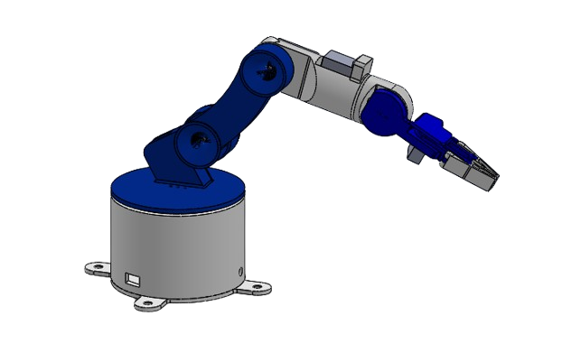

<p align="center">
  
</p>
# IoT-Based 5-DOF Robotic Arm Design

A complete mechanical design project focused on the development of a low-cost 5-degree-of-freedom robotic arm for educational and research applications. The project covers the complete design process, from defining design requirements and selecting actuators to CAD modeling, payload analysis, and final assembly.

---

## Project Overview

This project aimed to design a compact robotic arm capable of performing pick-and-place operations while remaining inexpensive, lightweight, and easy to manufacture using 3D printing.

The robotic arm was designed as part of a multidisciplinary project integrating:

- Mechanical Design
- Electronics
- Embedded Systems (ESP32)
- Web-Based Control
- IoT Communication

## My Contribution

This project was completed as part of a multidisciplinary university team. My role focused exclusively on the **mechanical design** of the robotic arm.

My responsibilities included:

- Defining the mechanical architecture
- CAD modeling of all structural components in SolidWorks
- Assembly design
- Servo selection and integration
- Link length optimization
- Center of mass and payload analysis
- Mechanical validation and design iterations

The electronics, embedded programming, and web interface were developed by my teammates.

---

## Design Objectives

The design focused on achieving:

- 5 Degrees of Freedom
- Low manufacturing cost
- 3D printable components
- Compact desktop footprint
- Lightweight moving links
- Adequate payload capacity
- Smooth joint motion
- Easy assembly and maintenance

---

## Mechanical Design

The mechanical design process included:

- CAD modeling of all components using SolidWorks
- Assembly design
- Servo integration
- Structural optimization
- Link dimension optimization
- Center of mass analysis
- Payload estimation
- Design for additive manufacturing

---

## Hardware

Main components include:

- ESP32 microcontroller
- MG996R servo motor
- SG90 servo motors
- 3D printed PLA structure
- Gear-driven gripper mechanism

---

## Design Process

The project followed an iterative engineering workflow:

1. Define design requirements
2. Select servo motors
3. Create preliminary CAD model
4. Evaluate torque requirements
5. Optimize link lengths
6. Reduce moving mass
7. Analyze center of mass
8. Estimate payload capacity
9. Finalize assembly

---

## Software Used

- SolidWorks
- Arduino IDE
- ESP32

---

## Repository Structure

```
robotic-arm-design
│
│
├── cad
│   ├── Final_Assembly.zip
│
├── images
│   ├── assembled.png
│   ├── exploded_view.png
│   ├── render.png
│   ├── mechanism.png
│   └── payload_analysis.png
│
├── videos
│   └── exploded_view.mp4
│
└── README.md
```

---

## Key Results

The final design achieved:

- Compact 5-DOF architecture
- Lightweight moving structure
- Optimized link dimensions
- Stable mechanical configuration
- Successful payload analysis
- Smooth range of motion
- Ready for manufacturing using 3D printing

---

## Engineering Challenges

Some of the challenges addressed during the design process included:

- Selecting suitable servo motors within a limited budget
- Reducing moving inertia while maintaining structural rigidity
- Balancing reach and payload capacity
- Optimizing the center of mass
- Designing a compact wrist assembly
- Integrating all mechanical and electronic components

---

## Future Improvements

Potential future developments include:

- Aluminum structural components
- Higher-torque servo motors
- Force feedback
- Machine vision
- Automatic object detection
- Higher payload capacity

---

## Author

**Hussein Issa**

Mechanical Engineering Student  
Al Maaref University

Interested in:

- Mechanical Design
- Robotics
- Mechatronics
- Control Systems
- Automation

LinkedIn:
https://www.linkedin.com/in/hussein-issa-90a560358
